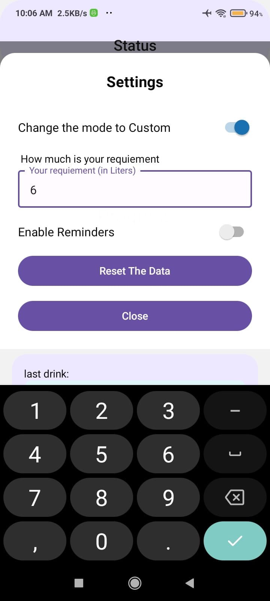
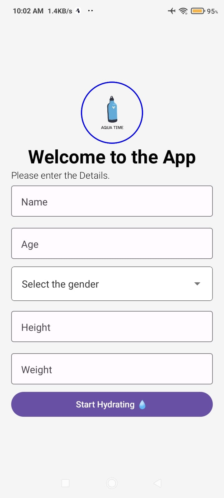
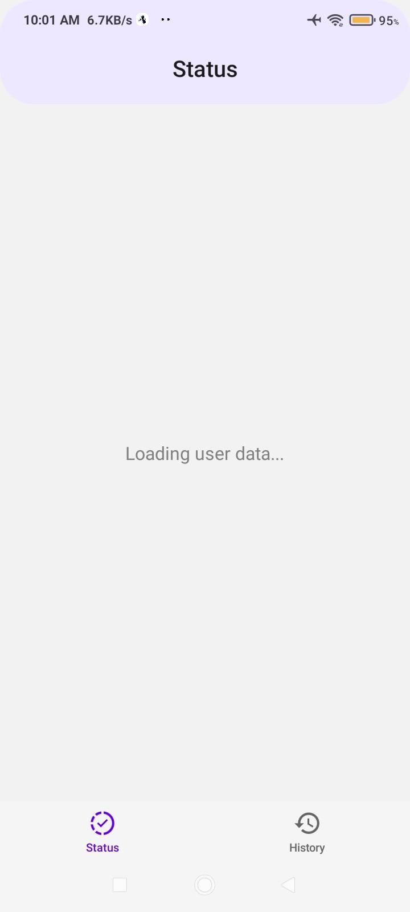
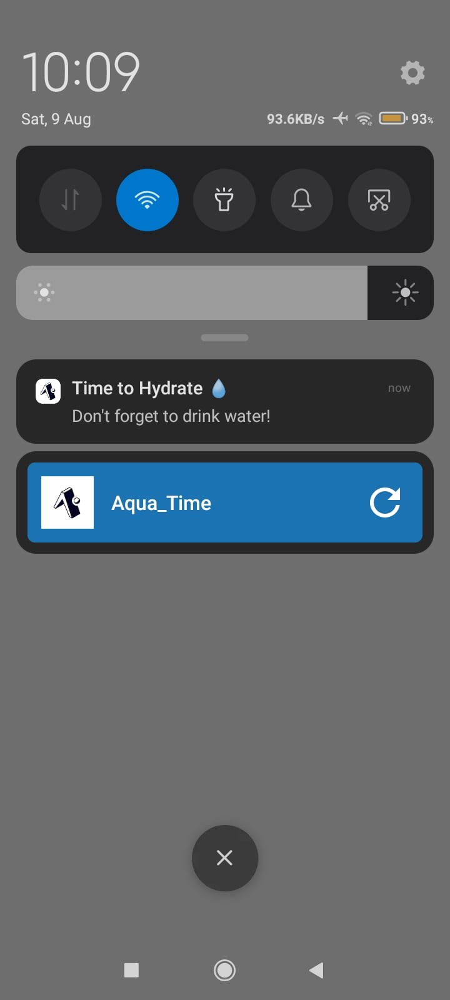
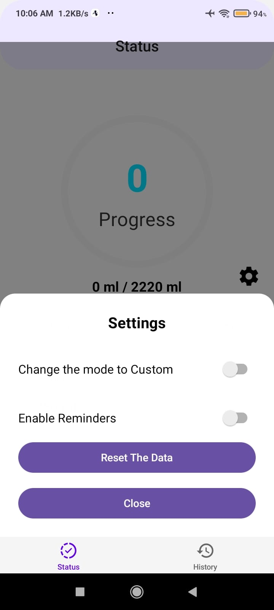
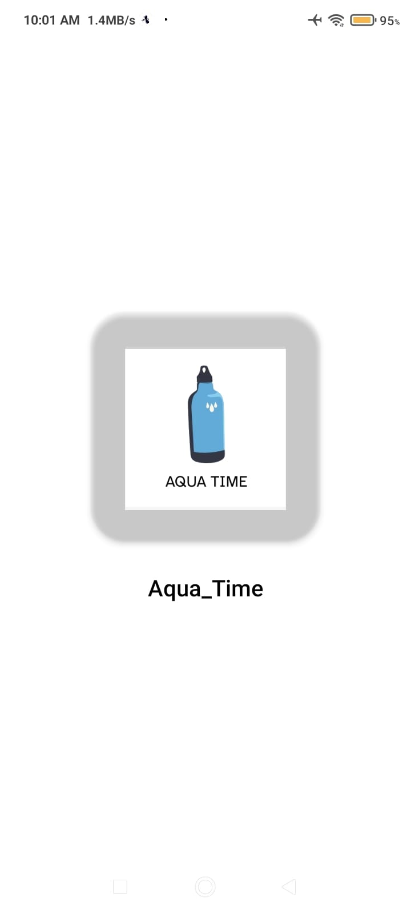
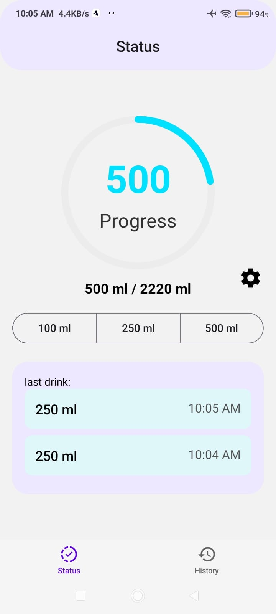

# 💧 Aqua Time – Drink Water Reminder App

Aqua Time is a React Native mobile application built using Expo that helps users stay hydrated throughout the day by tracking their water intake and sending periodic reminders. It calculates daily water requirements based on user input and provides a clean UI to log and monitor hydration goals.

---

## 📱 Features

- 🚀 **Get Started Flow** – Collects user details like name, age, gender, height, and weight.
- 📊 **Status Screen** – Displays circular progress of water consumed with hydration tips.
- ⏰ **Hourly Reminders** – Sends customizable push notifications to remind users to drink water.
- 📆 **Today's History** – Logs and displays water intake history for the current day.
- ⚙️ **Settings Modal** – Toggle between automatic/custom water requirements and enable/disable reminders.
- 💡 **Hydration Tips** – Encourages healthy hydration habits through helpful tips.
- 🧠 **Persistent Storage** – All user data and intake history stored using async local storage.

---

## 🛠️ Tech Stack

- **React Native** with **Expo**
- **TypeScript**
- **React Navigation**
- **AsyncStorage** (for persistent local storage)
- **Expo Notifications** (for scheduling push reminders)
- **React Native Paper** (UI components)
- **Custom Hooks & Context API**

---
## 📸 Screenshots

> All screenshots are located in `assets/appScreenshots/`

### 🔹 App Screens

#### 1. Custom Settings Screen

#### 2. Get Started Screen

#### 3. Loading Screen

#### 4. Notification Prompt

#### 5. Settings Modal

#### 6. Splash Screen

#### 7. Status (Progress) Screen

---

Let me know when you’re ready to paste the screenshot section — or if you'd like a more advanced or styled version of the README later.
---
This app is under active development.
New features and improvements will be added soon!
